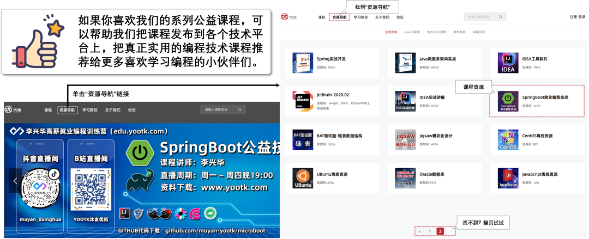

沐言科技 —— 李兴华编程训练营
===========================
```
沐言科技（www.yootk.com）是由李兴华老师亲自打造的高端软件编程教育训练营，
也是中国唯一一家拥有自主教材与教学资料研发的专业编程教育机构，是中国新一代软件教育的领导者与缔造者。
```

<strong>
<p>做我们自己的教育，不需要去和其他机构比较，因为我们搞的是教育，其他培训机构搞的是商业运作。</p>
<p>师资全部来自于一线大厂技术架构，讲师开发经验平均为8 ~ 15年，技术深度行业之最。</p>
<p>行业技术引领，传播行业内最新最流行的软件技术，为广大技术爱好者带来最有价值的编程教育体系。</p>
<p>近千万的真实教学视频传播范围，500,000+的编程图书销量，行业之最。</p>
<p>精心设计的教学课程体系，我们只做行业领航者。</p>
<p>真正的一线技术讲师倾力打造“李兴华高薪就业编程训练营”，只为奋斗的你而努力。</p></strong>


****

<p>不知不觉间又过了匆匆数月，而这本图书也正好是我个人所出版的第20本技术图书，从我确定要写这本图书开始就进入了不眠不休的创作过程，每一个字每一张图都力争原创，写一本好书是每一位有良心的作者的共同心声，而每一本好书的背后所体现的就是我们从业者的职业态度以及作为一名职业讲师所拥有的教育责任心。</p>
<p>技术行业每天唯一不变就是每天都在改变，而技术的每一次革新都在不断催促着行业的发展。而作为一名技术爱好者以及一线技术讲师，我们每天的工作就是在不断的学习新的技术理论与熟悉新的技术工具，但是依然也有很多不理解我们这类技术讲师工作的外行人，总是在不断的嘲笑我们不思进取。我承认这个行业有很多的摸鱼者，但是并不是所有的人都喜欢安于现状，我每天唯一想做的事情就是如何超越自己，每天进步一点点是我人生恪守的信条，而最让我恐慌的就是我自己的原地踏步与不思进取。</p>
<p>当今早已不是那个学会一门手艺吃一辈子的年代了，每位技术从业者除了要熟练的掌握基础理论之外，还需要不断的学习，并且不断的尝试突破创新。我从2008年开始编写第一本Java图书开始所度过的每一天的写作生涯，都在不断的尝试写作风格的变更，因为我想要出版一系列真正的好书，让所有读者真正可以读懂，工作中用得上的好书，而不是买来后扔在墙角慢慢让其发霉变质。</p>
<p>最近的十年里我一直都在强调教育的本质是付出是分享，教育不是一个赚钱的工具，真正的老一辈教育家都会无偿的为自己的教育事业默默奉献。然而当今社会上培训机构的各种乱象层出不穷，也使很多的新的从业者丢失了这份责任，而此刻的我就希望通过自己的努力让教育回归它本身的面目，让互联网教育也回归它最初的样子，我相信在广大技术爱好者的共同努力下，这一天一定会来到。</p>
<p>说起微服务我是从2016年的时候开始接触的，而当时也是国内微服务刚刚兴起的时候，于是我在2017年01月份完成了我的第一本微服务的技术图书《Java微服务架构实战》，但遗憾的是由于各种无法控制的外部原因，此书一直到2020年的01月份才正式出版，而大家知道此时的SpringBoot版本早已经更新到了SpringBoot 2.x，也就是说我的书还没到大家手里就已经彻底过时了，而这也成为了我整个出书史上最为糟心的一幕。为了弥补心中的这份遗憾，我才决定在2021年的时候重写一本新的SpringBoot图书，这也是本书编写最重要的一个原因，而另外的一个原因就在于市面上的很多图书大多千篇一律缺少“图书的灵魂”，于是我要写一本全新的，与众不同的SpringBoot图书，为的是将真正且系统的SpringBoot技术完整的传播，同时也希望可以将自己的这份的原创精神传递给更多的技术爱好者。</p>
<p>本书是一本纯粹性的讲解SpringBoot技术的图书，书中的章节组成来自于SpringBoot官方学习文档，同时又追加了我自己对技术的理解以及读者认知模式的思考而形成的一本原创图书，该图书的主要特点如下：</p>
<ul>
    <li>基于Gradle构建工具实现开发讲解，符合未来技术的发展需要；</li>
    <li>项目驱动型的讲解模式，让读者学习完每一节课程后都能有所收获，都可以将其应用到技术开发之中；</li>
    <li>为避免晦涩的技术概念所带来的学习困难，本书绘制了大量的图形进行概念解释，进一步简化学习难度；</li>
    <li>SpringBoot项目结构全面拆解，深入分析SpringBoot的运行机制、实现原理与核心源代码解析；</li>
    <li>大量的服务整合应用，例如：SpringSecurity、Shiro、MyBatis/MyBatisPlus、SpringDataJPA、JWT、Druid、Atomikos、FastJSON、itextpdf 、EasyPOI、Undertow、Logback、Prometheus、Grafana、WebService、WebSocket、RSocket、WebFlux、Redis、ShedLock、Thymeleaf等，全面打造航母级的SpringBoot应用实战；</li>
    <li>围绕前后端分离的开发模式讲解SpringBoot应用，并结合Vue.JS实现代码整合与项目实战；</li>
    <li>完整的教学体系，前后课程以及技术概念无缝对接，打造了一套循序渐进的适合于国人传统的学习模式；</li>
    <li>配备全套教学视频，打开手机微信可以直接扫码学习；</li>
    <li>丰富的课程离线资源包：4K教学视频、课程代码、教学PPT、软件工具包；</li>
</ul>
<p>众所周知Java技术的学习体系庞大，所涉及到的基础知识较多，而所有的学习者在正式接触到Java项目开发前都必须经历痛苦且漫长的基础知识理论学习才可以走向Java开发的岗位。而这本SpringBoot一书是Java整体课程学习的一个重要节点，是由理论基础学习到项目实战的重要转折点，学习者只有透彻的掌握了SpringBoot才可以向后继续学习SpringCloud，从而慢慢理解分布式开发架构，才能逐步走入Java架构师的技术岗位，获取较高的收入报酬。</p>
<p></p>
<p>虽然SpringBoot是现在Java开发中主要使用的开发框架，但是如果要想彻底学懂以及完全使用SpringBoot开发框架进行项目开发，还需要有一系列的技术前提。首先需要熟练的掌握《JavaWEB就业编程实战》一书中的全部基础技术，并深刻理解MVC框架设计与MVC项目实战，而后才可以轻松的理解Spring以及SpringMVC开发框架的实现原理，这样才可以为后续的SSM（Spring + SpringMVC + MyBatis）框架整合开发打下基础。而在《SSM就业编程实战》之中不仅仅讲解了SSM开发框架的整合，实际上还包含有基于Shiro的SSM（Spring + Shiro + MyBatis）以及JPA与SpringDataJPA的应用，因为这些技术最终全部都要求在SpringBoot中进行整合，而考虑到知识学习层次的需要，在本系列的图书中是将每一部分的知识进行有效的分割，以保证大家学习层次以及知识的延续性。</p>
<p></p>
<p>SpringBoot开发相比较于传统的SSM框架整合开发最大的特点在于其可以更加方便实现基于Restful前后端分离架构，所以在进行本书设计的时候充分的考虑到了当前的应用环境，讲解的核心重点也全部放在了后台接口的良好设计，这样的讲解也为了后续的《SpringCloud就业编程实战》一书的微服务集群架构打下了良好的概念基础。</p>
<p></p>
<p>考虑到知识的全面性本书在编写的时候大量的参考了SpringBoot官方学习文档，并且将官方学习文档的资料进行了重新的梳理，使其更加适合于国人的阅读习惯，经过一系列的筛选编写出了12章的具体内容，每一章都有一个核心的主题，同时每一章都为后续的章节提供概念上的支持，这些章节的安排如下：</p>
<ul>
<li><strong>第01章、SpringBoot概述：</strong>从传统的JavaEE（JakartaEE）的开发架构上阐述设计缺陷，同时分析了SSM框架整合开发中所存在的各类问题，并从宏观层次上介绍了SpringBoot技术特点以及与微服务之间的关联；</li>
<li><strong>第02章、SpringBoot编程起步：</strong>本次基于Gradle构建工具搭建了基础项目环境，并且分析了Gradle提供的各个开发插件的作用，最终给出了多模块环境下的SpringBoot项目搭建；</li>
<li><strong>第03章、SpringBoot环境配置：</strong>讲解了SpringBoot启动Banner修改、与原始Spring配置文件结合、项目热部署以及JUnit5测试工具的使用，同时深入讲解了Lombok组件配置以及生成类结构主要的作用；</li>
<li><strong>第04章、SpringBoot数据处理：</strong>程序是以数据处理为导向的组件集合，在本章中为读者分析了常见的几种文件结构的返回，例如：XML、JSON、PDF、Excel等，同时讲解了如何基于配置文件实现Bean注册；</li>
<li><strong>第05章、SpringBoot与WEB应用：</strong>SpringBoot程序主要是以WEB应用环境为主，所以在项目开发中可以方便的实现容器切换，并且可以直接使用JakartaEE所提供的内置对象来完成用户请求处理，在这一章中会将传统的WEB组件与SpringBoot进行整合，并实现了Email、Https、文件上传、数据验证的相关操作；</li>
<li><strong>第06章、Thymeleaf模版：</strong>SpringBoot可以很好的适应于单实例的项目开发，所以提供了Thyemeleaf模版组件的整合，在本章中将为读者分析模版文件的存储以及常见模版语法的使用；</li>
<li><strong>第07章、Actuator服务监控：</strong>SpringBoot内置有完整的监控数据获取支持，而要想进行合理的监控还需要整合Prometheus组件并结合NodeExport实现服务器的数据监控，在这一章中会对SpringBoot监控操作做深入讲解；</li>
<li><strong>第08章、SpringBoot与服务整合：</strong>自定义事件、分布式任务管理、WebService、WebSocket都属于常见的项目组件，在这一章中会基于各个组件依赖库进行服务的整合实现；</li>
<li><strong>第09章、SpringBoot异步编程：</strong>异步编程可以提高程序的处理性能，而在SpringBoot中支持有传统的多线程任务、Reactor响应式编程，在这一章中对异步编程的实现进行了整体的讲解，并且讲解了最新的RSocket协议支持；</li>
<li><strong>第10章、AutoConfig与Starter：</strong>自动配置是SpringBoot技术的宣传亮点，也是实现零配置的关键，在这一章中为读者分析了自动配置的实现，并且基于SpringBoot启动程序类实现了SpringBoot应用启动分析；</li>
<li><strong>第11章、SpringBoot与数据库编程：</strong>SSM是现代项目开发的主要应用框架，而SpringBoot简化了Spring以及SpringMVC的使用，但同时也需要引入MyBatis组件实现数据层开发，在本章中讲解了Druid数据源配置、Druid监控、MyBatis/MyBatisPlus整合、JTA分布式事务实现；</li>
<li><strong>第12章、SpringBoot安全访问：</strong>认证与授权是系统安全之中永恒的话题，在这一章中为读者综合的讲解了常见的安全组件整合，包括SpringSecurity、OAuth2、JWT、Shiro，并且基于前后端分离的方式实现了认证与授权管理，而前端的开发为了简化统一使用了Vue.JS实现。</li>
</ul>
<p>除了以上的这些章节之外，考虑到读者对于前后端设计的需求问题，我们也在最后安排了一个具体的项目实战，在这个项目实战中将基于已有的前端项目（Vue.JS + ElementUI实现）实现了分布式认证管理以及数据跨域访问的实现，考虑到学习层次的问题，本书并没有具体的讲解这些前端的内容，而有兴趣的读者也可以参考本系列的前端课程。</p>
<p>我们在2019年的时候创办了沐言科技，希望可以用我们自己的信仰打造出全新的教学理念，因为长期以来我发现仅仅依靠简单的技术教学是不能够让学生走上技术岗位，现在的技术招聘更多的是强调学生的自我学习能力，所以我们也秉持着帮助学生自学提升技术的方式进行图书的编写，同时我们也会在抖音与B站直播间进行各种技术课程的公益直播，也欢迎广大学子扫描下图所示的各个二维码在不同的平台找到我们与我们互动，让我们一起进步，打造出适合于所有学生的教学模式，也欢迎广大读者可以将我们的视频上传到各个平台上，把我们的教学理念传播给更多有需要的人们。</p>
<p></p>
<p>本书是完全原创的技术类图书，我们已经尽可能的进行错误与歧义文字的排查，但是由于人工有限，难免会出现文字或图形表达不准确的问题，对于这些也希望广大读者可以帮助我们检查，如果发现问题欢迎将错误信息发到我的邮箱（784420216@qq.com），我们也会及时修改，如果读者需要获取相关的课程资源，可以登录沐言优拓（www.yootk.com）的官方网站通过资源导航获取下载链接。</p>
<p></p>
<p>最后的最后我想说的是，因为写书与各类的公益技术直播，我错过了许多与我孩子和家人欢聚的时光，我内心感到非常的愧疚，但是我希望不久的未来我能为我的孩子编写一套属于他自己的编程类图书，帮助所有有需要的孩子进步，因为我喜欢研究编程技术，也勇于自我突破，如果你也是这样的一位软件工程师，也希望加入到我们这个公益技术直播的行列之内，让我们抛开所有的商业模式的束缚，一起将自己学到的技术传播给更多的爱好者，以我们微薄之力推动整个行业的技术发展，就如同我说过的，教育的本质是分享，并不是赚钱的工具。</p>

****

|Author|李兴华|
|---|---
|E-mail：|784420216@qq.com
|课程咨询微信：|muyan_yootk
|课程咨询QQ：|2273627816
|VIP课程大纲：|edu.yootk.com

